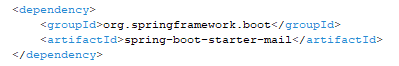

## Come installare il progetto
#### Step 1: Installazione di un IDE
Installare un IDE che supporti Java, uno dei più conosciuti è Eclipse. È possibile scaricare l'installer dal sito ufficiale https://www.eclipse.org/downloads/download.php?file=/oomph/epp/2024-09/R/eclipse-inst-jre-win64.exe e, durante il processo di installazione, selezionare l'opzione per Java Developer.
#### Step 2: Configurazione di Spring Boot su Eclipse
Una volta completata l'installazione di Eclipse, procedere con l'installazione del framework Spring Boot tramite il Marketplace di Eclipse. 
Qui sotto sono illustrati i passaggi dettagliati tramite immagini per facilitare la configurazione.

##### Passaggi:

1 . Fare clic su Help nella barra dei menu e selezionare Eclipse Marketplace.

2 . Nella barra di ricerca del Marketplace, digitare "Spring Boot".

3 . Dalla lista dei risultati, selezionare la versione 4 di Spring Boot.

4 . Procedere con l'installazione di Spring Boot e, quando richiesto, fare clic su Trust Selected per completare il processo.

#### Step 3: Installazione di un Server Manager
Installlare un server manager, come XAMPP. È possibile scaricarlo dal sito ufficiale https://www.apachefriends.org/it/index.html. Qui sotto sono illustrati i passaggi dettagliati tramite immagini per guidare l'installazione.

##### Passaggi:

1 . Installare XAMPP e, una volta completata l'installazione, avviare il servizio MySQL facendo clic su Start nel pannello di controllo di XAMPP.

2 . Fare clic su Admin, che aprirà la pagina: http://localhost/phpmyadmin/index.php. Nella pagina di phpMyAdmin, creare un nuovo database chiamato caccia, selezionarlo e fare clic su Importa. Caricare il file caccia.sql dalla cartella del progetto, mantenendo le impostazioni di default.

#### Step 4: Importare il Progetto sull'IDE

##### Passaggi:
1 . Selezionare File in alto a sinistra e, dal menu a tendina, scegliere Importa.

2 . Selezionare l'opzione Maven esistente.

3 . Selezionare la cartella in cui si trova il progetto e fare clic su Finish.

#### Step 5: Configurazione delle Application Properties

Le impostazioni di connessione al database e le impostazioni per l'email per l'invio dei form possono essere modificate nel file application.properties.

##### Esempio di configurazione:

Per gestire l'invio di email, è necessario impostare un'email nella riga spring.mail.username. Per quanto riguarda la password, è necessario accedere al proprio account Google e generare un codice, che andrà inserito alla riga spring.mail.password.

#### Step 6: File pom.xml

Il file pom.xml gestisce le dipendenze di Maven per l'applicazione Spring Boot e include tutte le librerie necessarie per il corretto funzionamento del progetto. Di seguito è riportato un elenco delle principali dipendenze utilizzate:

* ##### spring-boot-starter
Questa dipendenza include le configurazioni di base necessarie per un'applicazione Spring Boot. Fornisce il setup iniziale per avviare il progetto, inclusi i componenti fondamentali per l'esecuzione di un'applicazione Spring

* ##### spring-boot-starter-mail
Questa dipendenza fornisce il supporto per l'invio di email all'interno di un'applicazione Spring Boot. 

* ##### spring-security-test
Questa dipendenza fornisce strumenti per testare la sicurezza nelle applicazioni Spring, in particolare per quanto riguarda l'autenticazione e l'autorizzazione.

* ##### spring-boot-starter-security
Questa dipendenza fornisce l'integrazione di Spring Security in un'applicazione Spring Boot. Abilita facilmente le funzionalità di sicurezza, come l'autenticazione, l'autorizzazione e la protezione delle risorse.

* ##### spring-boot-starter-test
Questa dipendenza fornisce le librerie necessarie per eseguire test in un'applicazione Spring Boot.

* ##### mariadb-java-client
Questa dipendenza fornisce il driver JDBC necessario per connettersi a un database MariaDB. È utilizzato per permettere a un'applicazione Spring Boot di interagire con un database MariaDB in fase di runtime.

* ##### spring-boot-devtools
Questa dipendenza fornisce strumenti utili durante lo sviluppo, come il riavvio automatico dell'applicazione e il supporto per la rilevazione dei cambiamenti nel codice senza dover riavviare manualmente l'applicazione.

* ##### spring-boot-starter-data-jpa
Questa dipendenza fornisce il supporto per l'integrazione di Spring Data JPA in un'applicazione Spring Boot. Permette di lavorare con basi di dati relazionali utilizzando il Java Persistence API (JPA).

* ##### spring-boot-starter-web
Questa dipendenza fornisce il supporto per sviluppare applicazioni web con Spring Boot. Include tutti i componenti necessari per costruire applicazioni basate su HTTP, come il supporto per i controller REST, il framework Spring MVC, e il server embedded Tomcat (di default). 

* ##### thymeleaf-extras-springsecurity6
Questa dipendenza fornisce l'integrazione di Thymeleaf con Spring Security per le versioni 6. Permette di utilizzare funzionalità di sicurezza direttamente nei template Thymeleaf, come la gestione di autorizzazioni e ruoli, il controllo dell'accesso alle pagine o sezioni specifiche in base ai permessi dell'utente. 

* ##### spring-boot-starter-thymeleaf
Questa dipendenza fornisce il supporto per utilizzare Thymeleaf come motore di template nelle applicazioni Spring Boot.

#### Step 7: Esecuzione dell'Applicazione
##### Passaggi per l'esecuzione:
###### 1 . Avvio dell'applicazione:
Una volta completata la compilazione, avviare l'applicazione utilizzando l'opzione "Run As" > Spring Boot App. Questo avvierà l'applicazione sul server locale con la porta predefinita 8080.
###### 2 . Verifica dell'esecuzione:
Aprire il browser e navigare verso http://localhost:8080 per verificare che l'applicazione sia in esecuzione correttamente.