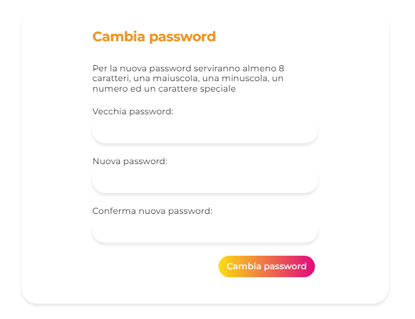

## Manuale utente

#### Login
Una volta entrati all'interno della sezione "Caccia EducatiON" nella navbar apparirà un bottone con su scritto area riservata.

Una volta cliccato si aprirà la pagina di login.

Se si ricordano le credenziali basterà inserirle per accedere al proprio profilo.
In caso si fosse dimenticata la password bisognerà cliccare sul tasto "Password dimenticata?".

In questa pagina ci sarà un modulo da compilare con la mail utilizzata per l'account. In questo modo si riceverà una mail con un link per poter impostare nuovamente la password.

Il link porterà ad un'altra pagina con un altro modulo da compilare con la nuova password. Dopo il reset si potrà effettuare l'accesso nella pagina di login.

#### Menu
Tramite il menu a sinistra si potrà navigare tra le varie pagine. In caso di un utente admin si avranno dei tasti in più che serviranno per gestire al meglio gli altri utenti.

ADMIN

USER

#### Profilo
Dopo l'accesso la prima pagina che si vedrà sarà quella del profilo con il riepilogo delle informazioni dell'utente autenticato (mail, nome, cognome, immagine profilo).

Qua se l'utente lo desidera potrà cambiare il nome e cognome cliccando sul tasto modifica.

#### Lista utenti (admin)
In questa sezione si avrà una tabella con tutti gli utenti registrati. Si potranno effetuare delle ricerche in base a:
* nome
* cognome
* mail
* nome + cognome 
* cognome + nome

Oltre alla ricerca si potranno ordinare gli utenti in base al cognome dalla a alla z e viceversa.

Vicino ad ogni utente ci saranno i tasti necessari per poter eliminare o visualizzare il profilo, tranne per chi è autenticato. 

VISUALIZZA PROFILO
Visualizza profilo permetterà di visitare l'account di un utente specifico e controllare quali taskgli sono stati assegnati.
 

ELIMINA
Dopo aver cliccato elimina apparirà una pagina con il riepilogo delle informazioni legate all'utente, in più se avrà dei task in sospeso apparirà la tabella.

#### Registra utente
In questa pagina si potranno registrate nuovi account. Dopo la creazione la persona potrà cambiare nome, cognome e password se lo vorrà.

#### I tuoi tasks
Qua si potranno visualizzare i task assegnati all'utente loggato. La sezione dei filtri aiuterà a smistare i task e facilitare la ricerca.

#### Cambia password
Pagina per poter modificare la propria password.

#### Visualizza richieste
Come struttura assomiglia alla pagina "I tuoi tasks", ma in questo caso si potranno vedere tutte le richieste arrivate fino ad ora.

#### Immagine profilo
In questa sezione verranno disposte tuttle le immagini profilo utilizzabili.

